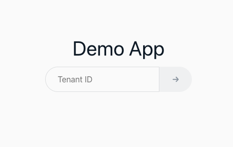

# How to deploy

To deploy the demo, you will need the latest versions of the tools listed below. If you have not installed it yet, please install it in advance.
* AWS CLI
* AWS CDK CLI
* Docker

Create various resources using AWS CDK. If you haven't already installed the latest AWS CDK, install it by following the instructions here. Additionally, if you have not previously provisioned resources for deployment with AWS CDK, bootstrap with the following command: Please specify the region to deploy to `<YOUR_REGION>` (e.g. ap-northeast-1).
```
ACCOUNT=`aws sts get-caller-identity --query 'Account' --output text`
REGION="<YOUR_REGION>"

cdk bootstrap aws://$ACCOUNT/$REGION
```

Once you're ready, run the following command to deploy.

```bash
cd cdk
npm i
cdk deploy
```

Once completed, connect to the URL output by the command below and the login screen will be displayed.
```bash
aws cloudformation describe-stacks --stack-name SaaSAuthDemoStack --output text --query "Stacks[*].Outputs[?OutputKey=='URL'].OutputValue"
```





The application deployment is now complete.