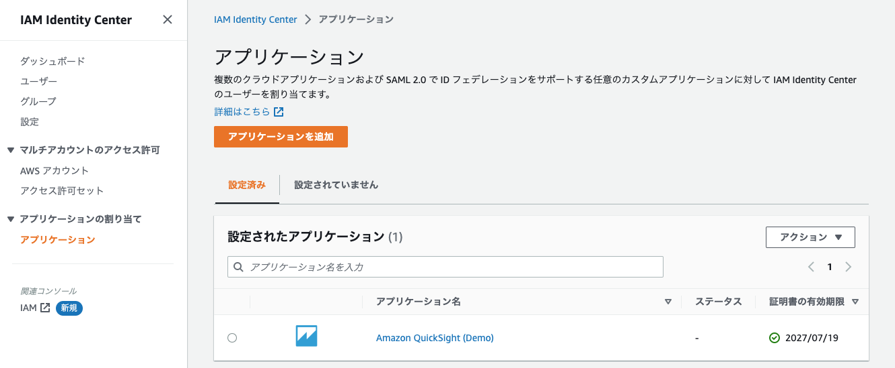
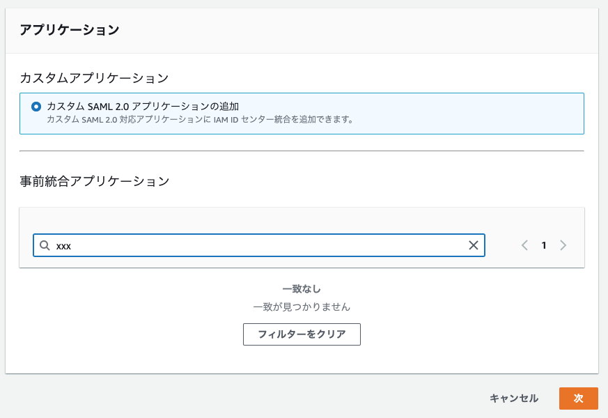
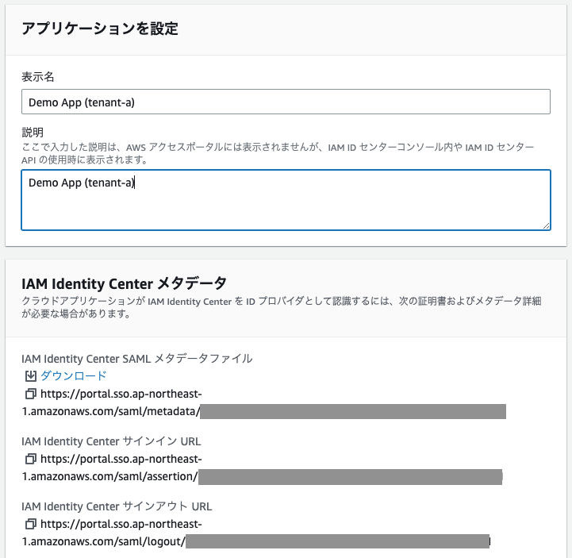
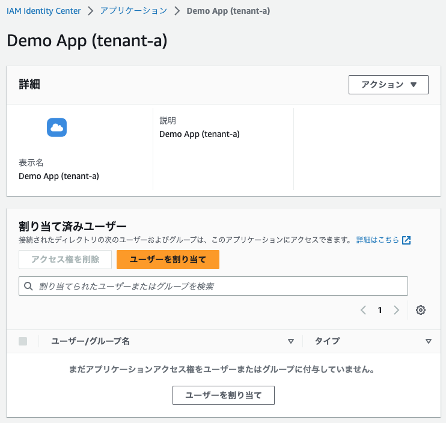
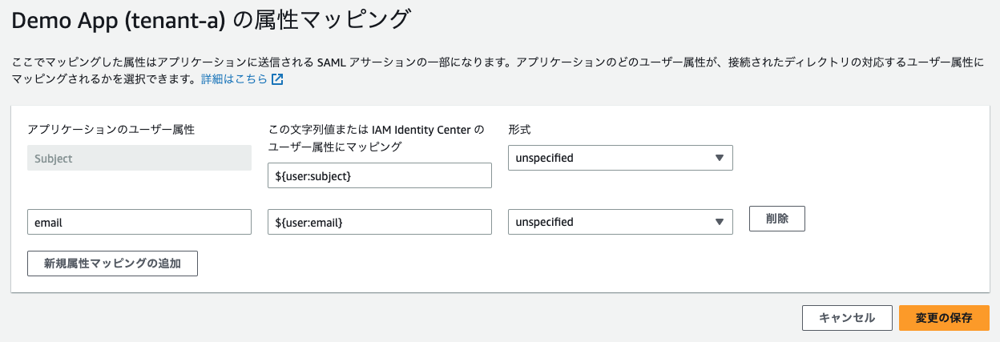
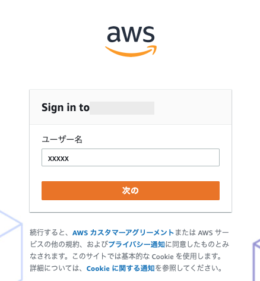
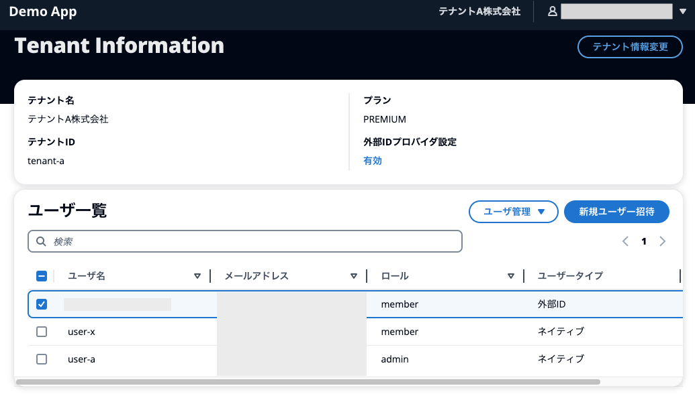

# Tenant and user management

After [signing in] (sign-in.md) as the `user-a` user with the `admin` role, manage users and tenants from the application.

## 1. Review and update your profile

When you first log in, you will be redirected to the user's profile screen. Here, the user's attributes and token values are displayed.

Among these, user roles indicate privileges within a tenant. The `admin` user has administrative privileges for the tenant, and the `member` user only has viewing privileges within the tenant. For detailed access control, see [here](calling /docs//authorize.md#1-lambda-authorizer-).

When you change a user's display name from [Change Profile], a `PUT` request is sent to the application's `/api/{userId}/profile`. At this time, specify the ID token issued by Cognito in the `Authorization` header. You can also try this request using the CLI or [Postman](https://www.postman.com/) by copying the ID token on the screen.

## 2. Check and update tenant information

Clicking the tenant name at the top right of the screen will take you to the tenant management screen.

You can change the tenant name and tier from [Update tenant information]. The tenant's tier is included in the ID Token claim, but after changing it, it will not be reflected in the token until you sign in again or refresh the token.

You can invite new users or change the roles of existing users from the user list panel. When accessing with `tenant-a`, [Access control] (using the output of /docs//authorize.md#3-lambda-authorizer-) is set so that only `tenant-a` users can be viewed and managed. It is being done.

Here, we also check the behavior with the `member` role. Invite a new user with the `member` role. Log out from `user-a`, log in as the newly invited user, and try inviting new users or deleting users in the same way. As mentioned above, an error will be displayed stating that the `member` user does not have permission to operate users within the tenant.

## 3. Sign in with federation

### 3.1 Configuring an external IdP

Use IAM Identity Center as the external IdP for `tenant-a` and connect using SAML.

This procedure assumes that you have already set up AWS IAM Identity Center and created users and groups. If it is not set up, please refer to [here](https://aws.amazon.com/jp/premiumsupport/knowledge-center/assign-user-access-aws-sso/) and set it up as necessary. please.

First, sign in as the `admin` user of `tenant-a` and go to the tenant management screen. Next, click [Disable] under [External ID provider settings] to move to the ID provider management screen. Then, click [Register new ID provider] in the upper right corner.

Next, access the AWS IAM Identity Center screen in a separate window, select Applications from the left menu, and click Add Application.

Then click Add Custom SAML 2.0 Application and click Next.

Give the application a display name and description of your choice. Copy the URL of the IAM Identity Center SAML metadata file in the center of the screen. Make sure that [Specify metadata URL] is checked in the `Metadata` field on the demo application side, and enter the URL of the SAML metadata file you copied in the text box below.

Return to the IAM Identity Center window and at the bottom, under `Application Metadata`, make sure Enter metadata values manually is selected.

[Amazon Cognito documentation](https://docs.aws.amazon.com/ja_jp/cognito/latest/developerguide/cognito-user-pools-saml-idp.html)According to the **Application ACS URL**, the **Application ACS URL** is`https://<UserPool Domain>/saml2/idpresponse` **Application SAML Audience (SAML audience)** に `urn:amazon:cognito:sp:<UserPool ID>` Enter the.

These values are displayed as `ACS URL` and `Application URN` on the demo application screen, so copy and paste them into the IAM Identity Center screen.

If the above is correct, press [Submit] on the IAM Identity Center screen to create the SAML connection destination application. At the same time, click [Register] on the demo application to register IAM Identity Center as an external IdP for `tenant-a`. This allowed us to create a trust relationship between our IdP, IAM Identity Center, and our service provider, Cognito User Pools.

Next, specify the attributes that will be linked from IAM Identity Center, the IdP, to Amazon Cognito, the SP. Click **Edit Attribute Mapping** from Actions at the top right of the screen and enter the following values.

|Application User Attributes |Mapping|Format|
|-|-|-|
|Subject|${user:subject}|unspecified|
|email|${user:email}|unspecified|

Here, we're passing the user's email address in addition to a value that uniquely identifies it on the IdP. At this time, make sure that the same attribute name `email` is specified in the `Application user attribute` on the IAM Identity Center side and the `email attribute mapping` on the demo application side. This value maps to the `custom:emailFromIdp` custom attribute on the user pool.

Finally, click **Assign Users** and assign the users you want to have federated sign-in to the application you created. In the following steps, log in as the user to whom you assigned the application. The settings on the IAM Identity Center side are now complete.

### 3.2. Signing in users using an external IdP

In the demo application, open the [user-a] menu in the upper right corner and click [Logout].
If the logout is successful, the `tenant-a` sign-in page will be displayed again. At this time, confirm that a button called [Log in with external ID] has been added at the bottom of the screen. Clicking this button will take you to the sign-in screen for her IAM Identity Center that you configured earlier via her OIDC Endpoint in Cognito.

Now, sign in to AWS IAM Identity Center by entering the username and password of the user you selected earlier in **Assign User**. If the authentication is successful, you will be redirected to the application screen again.
After the screen is displayed after successfully signing in, move to the tenant management screen and confirm that a new user with `User type: External ID` has been created.

For technical details about federation sign-in, please see [here](/docs/federation-signin.md).