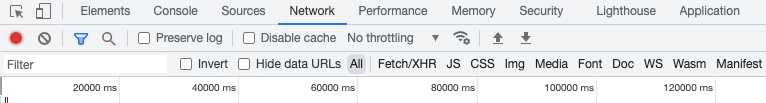
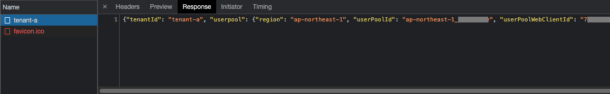
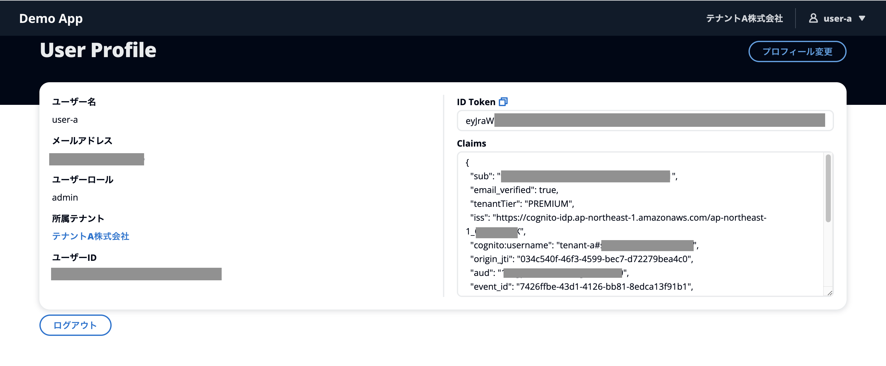

# Sign in to tenant

The tenant and user were created in the [onboarding] (onboarding.md) process, so sign in there.## 1. Access the sign-in screen
Access the URL output in the [Deployment method] (how-to-deploy.md) step and confirm that the sign-in form below is displayed.


## 2. Enter tenant ID

The following steps assume a demo using Google Chrome. Please change the reading for each browser as necessary.

At this point, open the Network tab in the developer tools.




Type `tenant-a` in the form and press [Enter].

## 3. Sign in

You will be redirected to `/login/tenant-a`, which is the tenant's dedicated sign-in page.
If we now check the developer tools, we can see that we are accessing the `/api/authconfig/tenant-a` endpoint of the backend app.



The response contains the app client ID for each tenant, and we use this value to set up the Amplify library.

[Login.tsx](/web/src/page/Login.tsx#L43)
```tsx
...
    getAuthConfig(tenantId).then((authConfig)=> {
      Auth.configure(authConfig.userpool);
      localStorage.setItem(`authConfig-cache.${tenantId}`, JSON.stringify(authConfig));
      setAuthConfig(authConfig);
      setIsReady(true);
    })
...
```

We use Amplify UI Components for the sign-in form. This allows you to leave the detailed interaction with the Cognito API to the library.

[Login.tsx](/web/src/page/Login.tsx#L88)
```html
  <Authenticator hideSignUp={true} components={components} services={services}>
    ...
  </Authenticator>
```

A link to the above page and a temporary password will be sent to the user email address you created earlier. Click the link to reconnect to the tenant-specific login page, enter your temporary password, and sign in. You will be asked to change your password, so change it to a password of your choice.

As mentioned in [Onboarding](/docs/onboarding.md), the user name on the user pool is created as `<tenantId>#<email>` for each user.
In order to make the user unaware of this, we hook the sign-in process on the form as shown below.

```typescript
  ...
  const services = {
    async handleSignIn({username, password}: {username: string, password: string}) {
      return await Auth.signIn(`${tenantId}#${username}`, password);
    },
    async handleForgotPassword(username: string) {
      return await Auth.forgotPassword(`${tenantId}#${username}`);
    },
    async handleForgotPasswordSubmit({username, code, password}: {username: string, code: string, password: string}) {
      return await Auth.forgotPasswordSubmit(`${tenantId}#${username}`, code, password);
    }
  };
  ...
```

## 4. Screen after signing in

After signing in, you will see the contents of the ID token issued by Amazon Cognito.



If you look at `Claims`, you will see that `aud` is set to the application client ID for the tenant.
In addition, the following values registered in the DynamoDB table are assigned by Cognito's [Lambda trigger before token generation](/cdk/functions/cognito-pre-token-generation/index.ts) as shown below. This can be confirmed.

| Claim name | Description |
|-|-|
| tenantId | Identifier representing the tenant that the user signed in to. |
| tenantTier | The contract plan of the tenant to which the user signs in. If you want to perform access control based on the tenant's contract plan, he will perform access control by referring to this claim inside the JWT. |
| userRole | The user's role within the tenant. Indicates whether the user is an administrator or a general user. If you want to perform access control based on the role within the tenant, perform access control by referring to this claim inside the JWT. |

Even in Cognito alone, it is possible to manage these values by linking them to users by using custom attributes.
However, if you choose to store values in Cognito that can change frequently or are tied to a tenant, such as userRole or tenantTier,
[Request quotas for reference and update](https://docs.aws.amazon.com/ja_jp/cognito/latest/developerguide/limits.html) should be carefully considered.

If you separate tenants using application clients in the same user pool, you will also need to manage which users are allowed to log in using which application clients.
The ``Lambda trigger before token generation'' of this demo application identifies the tenant based on the user pool ID and application client ID used for login.
If it is not associated with a user, an error will be returned. This prevents users from logging in with an unintended tenant.

## 5. Sign in with another tenant

Log out using the button at the bottom of the screen, then type `tenant-b` and press [Enter].
If you sign in as `user-b` that you created earlier, you can see that the attributes of tenant B, `user-b` are reflected in the `Claims` of the ID token.

